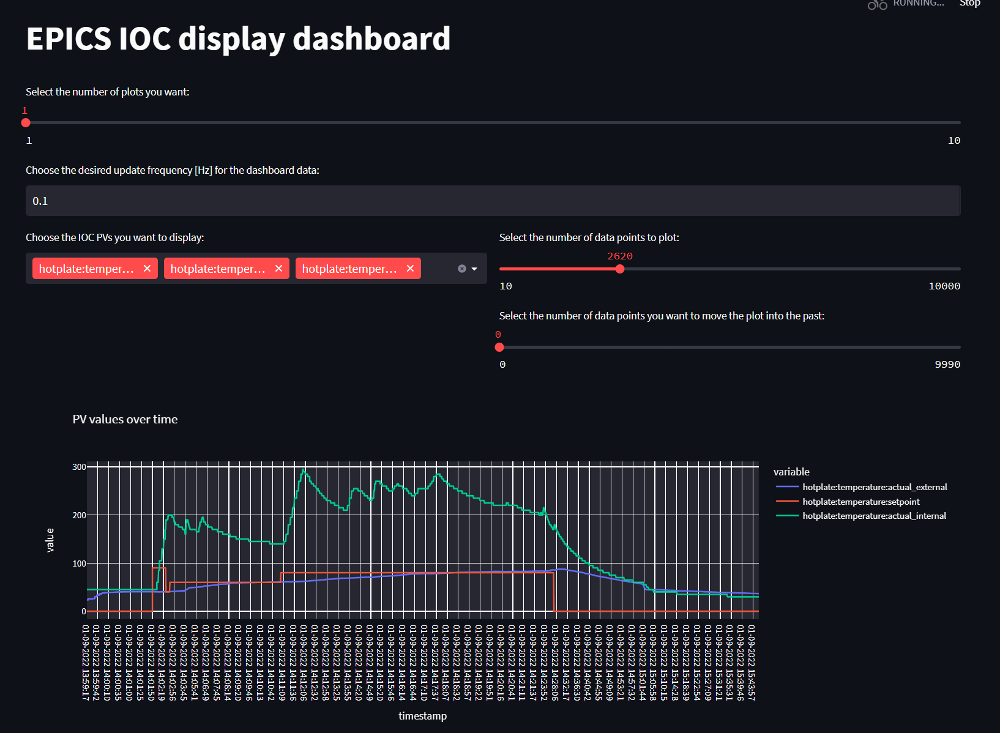

# EPICS Dashboard

## Installation
- Download or clone this repository to a directory of your choice.
- Install the required Python dependencies (given example for global installation, however installing the dependencies in a new virtual environment may be your preferred choice):
    > $ pip install -r requirements.txt
- Go into the 'IOC_PVs.txt' file and edit it to list all the process variables (PVs) that you want to access through the dashboard.

## Run the dashboard
- Run:
    >$ streamlit run dashboard.py
- The dashboard should now be accessible from your pc and (depending on your network settings) within your local network. The respective IP and port are listed in the terminal that you used to run the previous command. Head to that IP and port in your preferred browser, e.g. by putting '192.168.171.1:8501' in the search field for an example IP address of '192.168.171.1' and a port of '8501'.

## PVs
- Ensure that the PVs you'd wish to access in the dashboard are written in the 'IOC_PVs.txt' file and spelled correctly.
- For better dashboard performance, also ensure that you do not have PVs listed in the 'IOC_PVs.txt' file that are not accessible on the network at the moment since this slows down the internal updating process at the moment.
- You can comment out individual PVs by adding a '#' infront of the respective line.

## Implementation details
Understanding the implementation is not required for installation but may help in case of errors or if one wants to extend the dashboard's functionality.

- The 'dashboard.py' file launches a separate reading thread, an instance of the 'CALiveReader' class defined in CaprotoReaders/caproto_live_reader.py.
- This thread grabs all the specified PVs through PyEpics' 'caget' function synchronously (for now) at approximately the specified frequency.
- It then appends all these values to a pandas dataframe.
- This dataframe is accessible from the main thread in the 'dashboard.py' file and is continuously plotted through plotly.express' 'line' function.
- Streamlit takes care of all the sliders and selections and translates these into the lists.
- A general note on how Streamlit runs (from my understanding):
    - It __tries__ to execute the respective script that it was called on from top to bottom.
    - If an event like a new user selection occurs during execution, streamlit executes the file again from top to bottom.
    - Therefore, make sure to be careful with code that you only want to be executed once or so.
    - You can however set functions to be 'singletons', i.e. they'll only be executed once throughout the entire execution time.
    - Hence, the CALiveReader thread is started in a function of its own which is decorated with the respective '@st.experimental_singleton' decorator so we don't create an endless amount of 'CALiveReader' threads but just one.
    - Beware that the singleton decorator is experimental at this stage and might be subject to change with future versions of streamlit.
